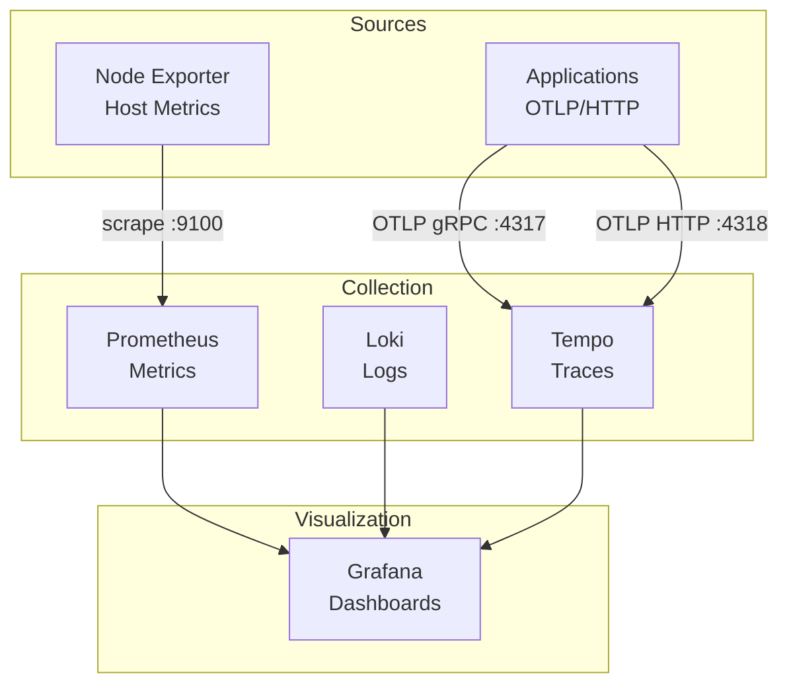

# Observability (Kubernetes)

 

Full observability stack: **metrics** (Prometheus), **logs** (Loki), **traces** (Tempo), and **visualization** (Grafana). Node Exporter provides host metrics.

## Architecture



| Component | Role | Port |
|-----------|------|------|
| **Prometheus** | Pulls metrics from targets, stores time-series | 9090 |
| **Loki** | Log aggregation (label-indexed) | 3100 |
| **Tempo** | Distributed tracing (OTLP gRPC/HTTP) | 3200, 4317, 4318 |
| **Grafana** | Unified dashboards, queries Prometheus, Loki, Tempo | 3000 |
| **Node Exporter** | Host metrics (CPU, memory, disk) | 9100 |

## Configure Grafana data sources

In Grafana, add these data sources:

- **Prometheus**: `http://prometheus:9090`
- **Loki**: `http://loki:3100`
- **Tempo**: `http://tempo:3200`

## Production note

Change `GF_SECURITY_ADMIN_PASSWORD` in `grafana-deployment.yaml` before deploying to production.

## Deploy

```bash
kubectl apply -k .
```

## Access

- Grafana: http://grafana.localhost.dev (via Traefik)
- Prometheus: port-forward `svc/prometheus -n observability 9090:9090`
- Loki, Tempo: cluster-internal or port-forward

## References

- [Prometheus](https://prometheus.io/) · [Grafana](https://grafana.com/) · [Loki](https://grafana.com/oss/loki/) · [Tempo](https://grafana.com/oss/tempo/)
