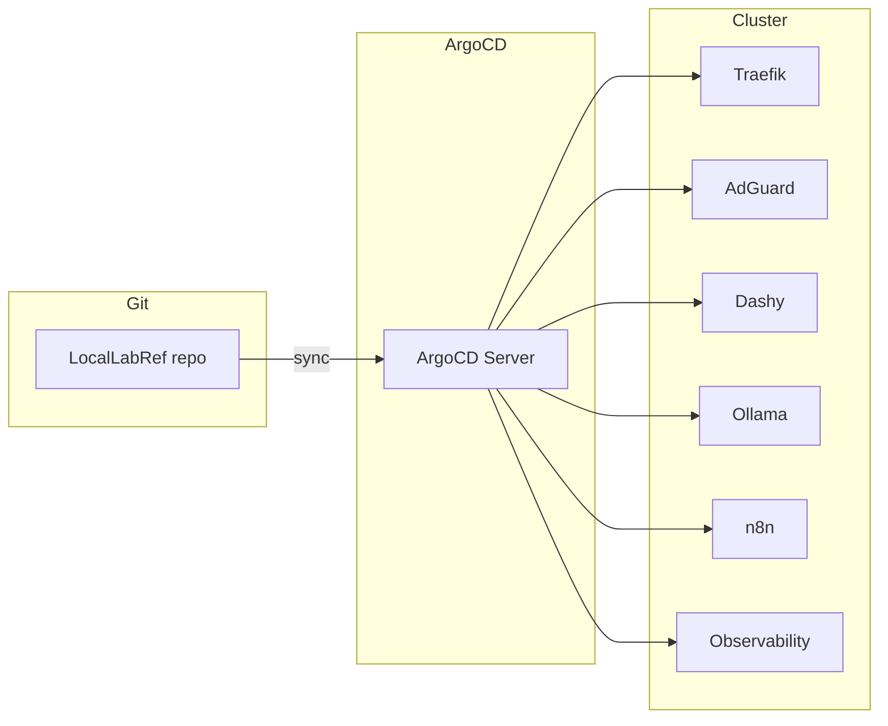

# ArgoCD


**ArgoCD** is a declarative, GitOps continuous delivery tool for Kubernetes. It syncs applications from Git repositories and keeps live clusters in sync with the desired state defined in manifests.

## What it does

- **GitOps** – Declarative deployment from Git; Git is the source of truth
- **Automated sync** – Continuously reconciles cluster state with Git
- **Multi-cluster** – Manages multiple Kubernetes clusters from one ArgoCD instance
- **Rollback** – Easy rollback to any previous Git revision

## Apps managed by ArgoCD

| App | Path | Namespace | Description |
|-----|------|-----------|-------------|
| **traefik** | `kubernetes/apps/traefik` | traefik | Reverse proxy and ingress controller |
| **adguard** | `kubernetes/apps/adguard` | adguard | DNS sinkhole and ad blocker |
| **dashy** | `kubernetes/apps/dashy` | dashy | Self-hosted dashboard for services |
| **ollama** | `kubernetes/apps/ollama` | ollama | Local LLM server |
| **n8n** | `kubernetes/apps/n8n` | n8n | Workflow automation with PostgreSQL |
| **observability** | `kubernetes/apps/observability` | observability | Prometheus, Loki, Tempo, Grafana, Node Exporter |

ArgoCD Application manifests: `traefik-application.yaml`, `adguard-application.yaml`, `dashy-application.yaml`, `ollama-application.yaml`, `n8n-application.yaml`, `observability-application.yaml`.

## Flow



## Deploy

```bash
./install.sh
```

## Configure

1. Update `*-application.yaml` files with your repo URL (path: `kubernetes/apps/*`).
2. Create Kubernetes secret for repo credentials if using private repo (not included here).
3. Copy `ingressroute.yaml.example` to `ingressroute.yaml` and set your domain.

## Access

- Port-forward: `kubectl port-forward svc/argocd-server -n argocd 8080:443`
- URL: https://localhost:8080
- Initial password: `kubectl -n argocd get secret argocd-initial-admin-secret -o jsonpath="{.data.password}" | base64 -d`

## References

- [ArgoCD](https://argo-cd.readthedocs.io/)
