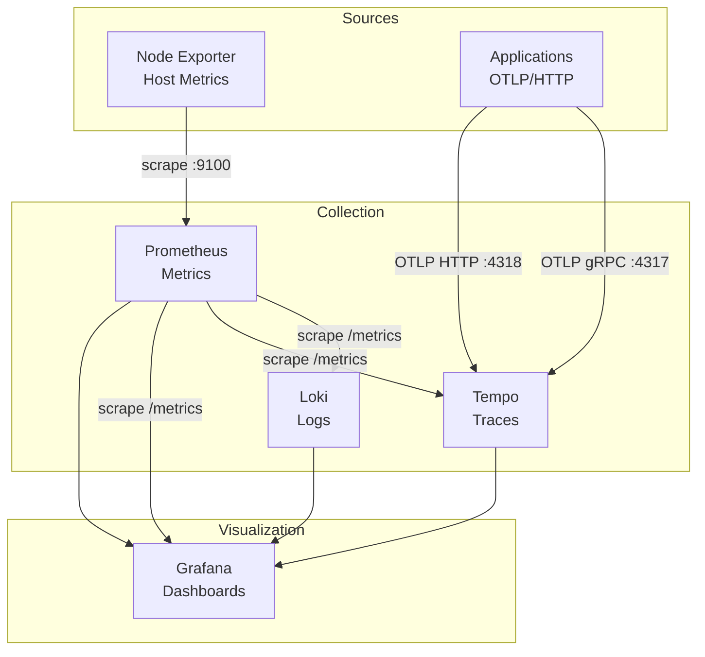

# Observability Stack

   

Full observability stack: **metrics** (Prometheus), **logs** (Loki), **traces** (Tempo), and **visualization** (Grafana). Node Exporter provides host metrics.

## Architecture



| Component | Role | Port |
|-----------|------|------|
| **Prometheus** | Pulls metrics from targets, stores time-series | 9090 |
| **Loki** | Log aggregation (label-indexed, like Prometheus for logs) | 3100 |
| **Tempo** | Distributed tracing (OTLP gRPC/HTTP) | 3200, 4317, 4318 |
| **Grafana** | Unified dashboards, queries Prometheus, Loki, Tempo | 3000 |
| **Node Exporter** | Host metrics (CPU, memory, disk) | 9100 |

## Makefile Commands

| Command | Description |
|---------|-------------|
| `make up` | Start all services |
| `make down` | Stop all services |
| `make restart` | Restart containers |
| `make logs` | Stream logs |
| `make ps` | List containers |
| `make status` | Containers + resource usage |

## Getting Started

```bash
cd observability
make up
```

Optional: copy `.env.example` to `.env` and set `GRAFANA_ADMIN_PASSWORD`.

## Access

| Service | URL |
|---------|-----|
| Prometheus | http://localhost:9090 |
| Grafana | http://localhost:3000 (admin/admin) |
| Loki | http://localhost:3100 |
| Tempo | http://localhost:3200 |

## Configure Grafana Data Sources

In Grafana (http://localhost:3000), add these data sources:

- **Prometheus**: URL `http://prometheus:9090`
- **Loki**: URL `http://loki:3100`
- **Tempo**: URL `http://tempo:3200`

## References

- [Prometheus](https://prometheus.io/) · [Grafana](https://grafana.com/) · [Loki](https://grafana.com/oss/loki/) · [Tempo](https://grafana.com/oss/tempo/)
